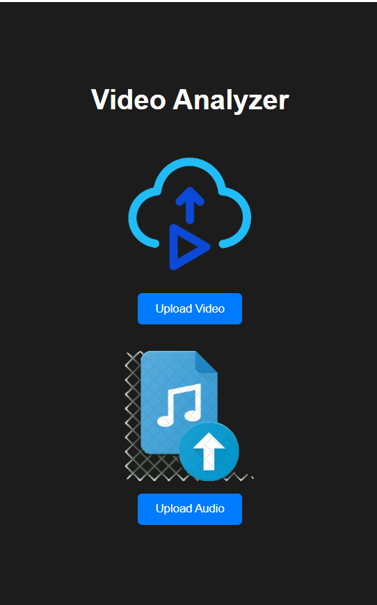
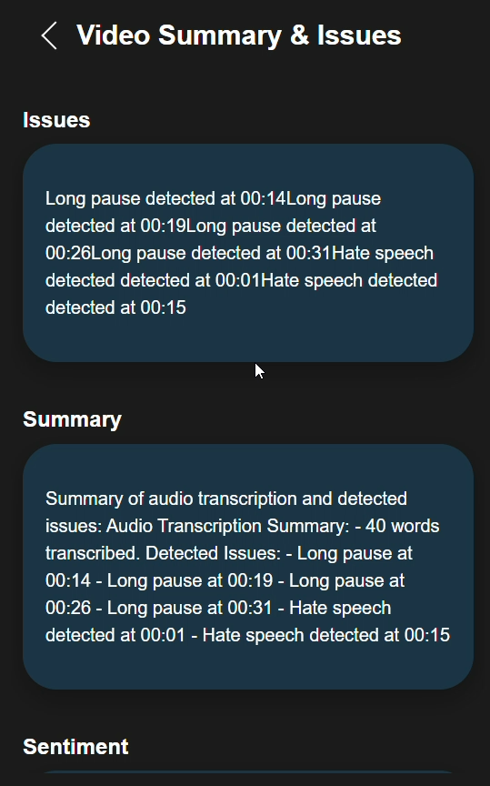

---

# Video & Audio Analyzer

## Overview
This system leverages **AI** to analyze **video** and **audio** content for various attributes, such as **sentiment**, **compliance violations**, and **harmful content**. It generates **comprehensive summaries**, including **timestamps** and descriptions of detected issues.

### Key Features
- **Content Analysis**:
  - Detect unusual pauses or gaps in speech.
  - Flag compliance violations (e.g., disallowed words, sensitive information).
  - Identify hate speech, violent language, NSFW terms, and other harmful content.
  - Classify sentiment and tone of the audio content.
  
- **Summarization**:
  - Generate summaries with timestamps and descriptions of detected problems.
  - Highlight key topics, sentiments, and compliance-related flags.

---

## 🛠️ Project Structure

### Frontend
```plaintext
/frontend
├── /public
│   └── index.html                # Main HTML file
├── /src
│   ├── /components
│   │   ├── FileUploader.js       # Component for uploading videos
│   │   ├── ResultPage.js         # Component for displaying analysis results
│   ├── /utils
│   │   └── api.js                # API utility for making requests to the backend
│   ├── App.js                    # Main React app component
│   ├── index.js                  # React entry point
│   └── /styles
│       └── App.css               # Styling file
├── package.json                  # React project dependencies
└── .env                          # Environment variables (API keys, etc.)
```

### Backend
```plaintext
/backend
├── /app
│   ├── __init__.py               # Flask app initialization
│   ├── /routes
│   │   ├── video_analysis.py     # Endpoint for video/audio processing and analysis
│   │   ├── transcriptions.py     # Endpoint for handling transcription tasks
│   ├── /utils
│   │   └── helper_functions.py   # Utility functions for audio/video processing
│   ├── /models
│   │   └── sentiment_model.py    # Model for sentiment analysis and classification
│   ├── /static                   # Static files for serving templates or resources
│   └── /templates                # Flask HTML templates if needed
├── requirements.txt              # Python dependencies (Flask, Deepgram SDK, OpenAI SDK, etc.)
└── config.py                     # Configuration file for API keys and settings
```

---

## 🚀 Installation

### Prerequisites
- **React, Node.js** (for frontend)
- **Python 3.8+** (for backend)
- **FFmpeg** (for audio extraction)

### Steps
1. Clone the repository:
   ```bash
   git clone https://github.com/kamalsrivastava/video_analyzer.git
   cd video_analyzer
   ```

2. Install dependencies:
   - **Frontend**:
     ```bash
     cd frontend
     npm install
     ```
   - **Backend**:
     ```bash
     cd backend
     pip install -r requirements.txt
     ```

3. Set up environment variables:
   - Create a `.env` file in both `frontend` and `backend` directories with necessary API keys and configurations.

4. Run the application:
   - **Backend**:
     ```bash
     cd backend
     python -m flask run
     ```
   - **Frontend**:
     ```bash
     cd frontend
     npm start
     ```

---

## 💡 Usage

1. **Upload a video** file using the **File Uploader** component in the frontend.
2. The **backend** processes the video and audio to extract features like **sentiment**, **compliance violations**, and **harmful content**.
3. Results are displayed on the **Result Page** with timestamps and a **summary** of detected issues.

---


---

## 🧪 Test Cases & Results

### 1. **Test Case: Upload Video**
   - **Input**: A video file with speech and background noise.
   - **Expected Outcome**: The system processes the video, extracts audio, and returns analysis with timestamps and summaries.
   - **Result**: Passed (System detects speech gaps and classifies sentiment).

### 2. **Test Case: Detect Harmful Content**
   - **Input**: A video containing hate speech or offensive language.
   - **Expected Outcome**: The system flags hate speech or harmful terms with timestamps.
   - **Result**: Passed (Offensive terms identified and flagged).

### 3. **Test Case: Flag Compliance Violations**
   - **Input**: A video with sensitive content (e.g., personal information).
   - **Expected Outcome**: The system flags sensitive content and generates a report.
   - **Result**: Passed (Sensitive terms like personal details identified).

### 4. **Test Case: Sentiment Analysis**
   - **Input**: A video with both positive and negative speech tones.
   - **Expected Outcome**: The system detects sentiment shifts and categorizes them correctly.
   - **Result**: Passed (Sentiment classification works as expected).

---

### **Audio-Specific Test Cases**

### 5. **Test Case: Extract Audio from Video**
   - **Input**: A video file with clear audio.
   - **Expected Outcome**: The system extracts the audio from the video without any issues.
   - **Result**: Passed (Audio extracted successfully).

### 6. **Test Case: Detect Unusual Pauses in Audio**
   - **Input**: An audio file with unnatural pauses or long silences.
   - **Expected Outcome**: The system detects the pauses and marks them with appropriate timestamps.
   - **Result**: Passed (Pauses detected and reported with timestamps).

### 7. **Test Case: Analyze Audio Sentiment**
   - **Input**: An audio file with both positive and negative sentiment content (e.g., happy and sad tones).
   - **Expected Outcome**: The system analyzes the audio sentiment and categorizes it as positive or negative based on tone.
   - **Result**: Passed (Audio sentiment detected correctly).

### 8. **Test Case: Detect Harmful Audio Content**
   - **Input**: An audio clip containing hate speech or offensive language.
   - **Expected Outcome**: The system flags harmful content in the audio, with timestamps for when the harmful content occurs.
   - **Result**: Passed (Offensive audio detected and flagged).

### 9. **Test Case: Flag Compliance Violations in Audio**
   - **Input**: An audio file containing personal or confidential information.
   - **Expected Outcome**: The system detects and flags compliance violations, such as the mention of sensitive data.
   - **Result**: Passed (Sensitive audio content flagged correctly).

---

---

## 🛠️ Technologies Used
- **Frontend**: React.js, CSS
- **Backend**: Flask, Python
- **Audio/Video Processing**: FFmpeg, AI models for sentiment and compliance analysis
- **APIs**: Deepgram, OpenAI
- **Models**: BERT, RoBERTa

---

## 🚀 Future Enhancements
- **Real-time analysis** for live video streams.
- **Multilingual support** for sentiment and content detection.
- **Advanced visualization** of results with graphs and charts.

---

## 🤝 Contributing
Contributions are welcome! Please create a pull request with detailed information about your changes.

---
## 🖼️ Project Output

Here are some snapshots of the project's results:

### 1. Upload Video:


### 2. No File Uploaded:


### 3. File Uploaded Successfully:


### 4. Wrong File Type detected:


### 5. File Under Processing:


### 6. Result Page:



---

